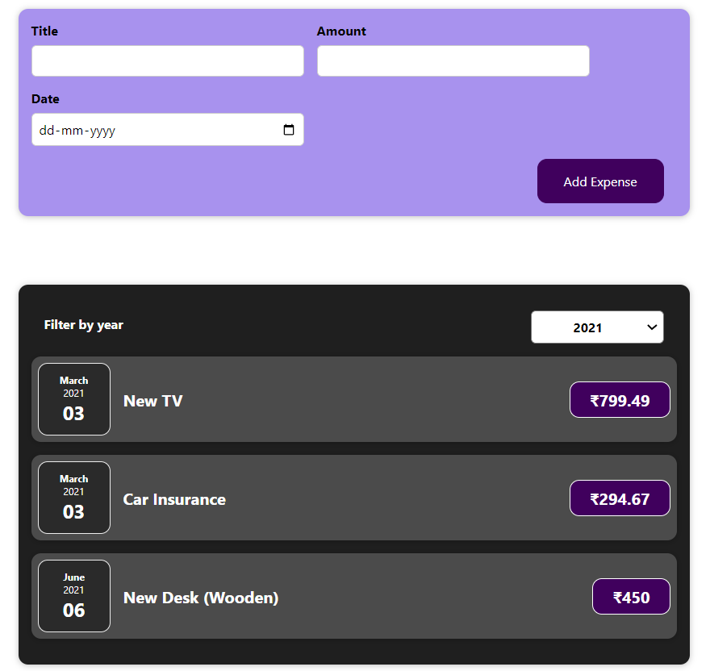

# Expense Tracker App

This app helps you to track your expenses. You can add a new expense by selecting the date, it will be updated in the list.
To check your expenses select the year you wish to view. By default current year is selected.

<h1>[Getting Started]</h1>
    <h3>Execution</h3>
    
If you want to run our project in your local machine

    
Follow the given steps:

    <ul>
        <li>Clone our respository <a href="https://github.com/Suhani1102/ExpenseTracker_React.git">https://github.com/Suhani1102/ExpenseTracker_React.git</a></li>
        <li>Open our code in VS code</li>
        <li>On your terminal just write the command npm install</li>
        <li>Initialize the server by writing 'npm run server' on Terminal</li>
        <li>Than you can navigate to our website.</li>
    </ul>
        <h1>Built with</h1>
    <ul>
        <li>React.JS</li>
    </ul>

